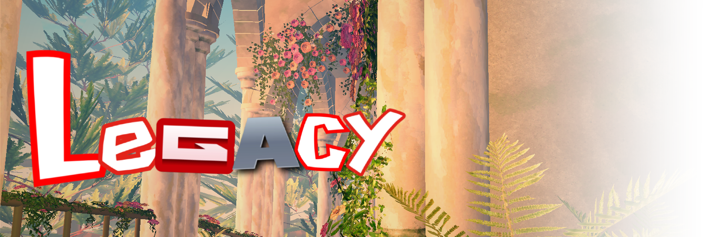
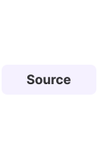
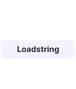
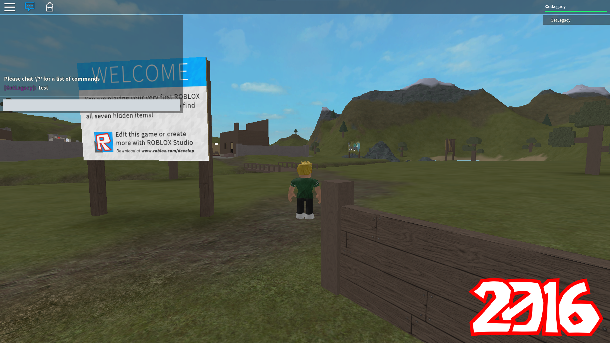
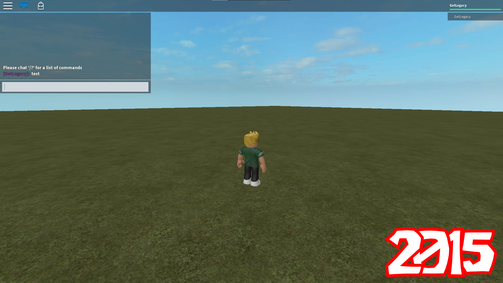
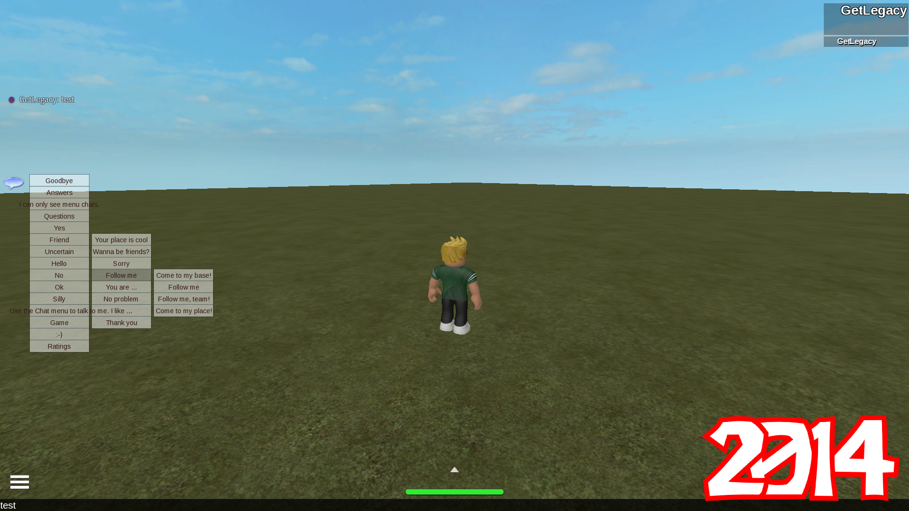
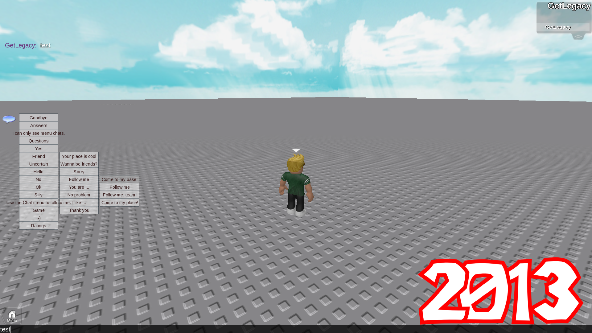
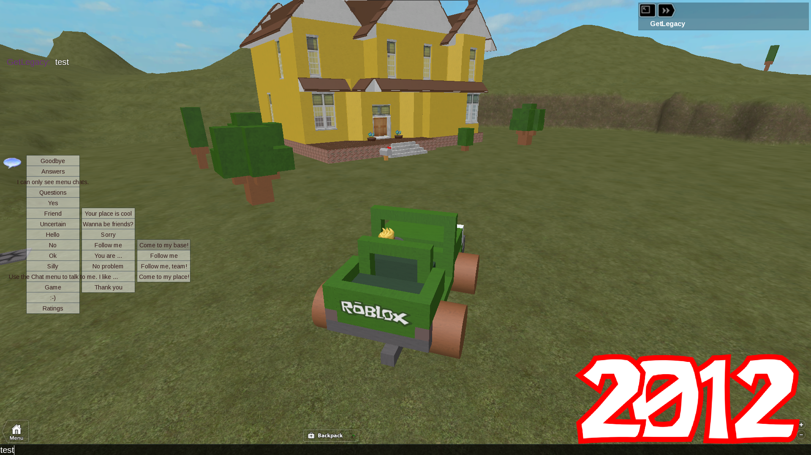

<a href="https://raw.githubusercontent.com/yeku/legacy/refs/heads/main/Source.luau">  </a>

<!--  -->

<a href="https://github.com/yeku/legacy#loadstring">  </a>


<p align="center">
  <a href="https://github.com/yeku/legacy/stargazers">
    
  </a>
  <a href="https://github.com/yeku/legacy/commits">
    
  </a>
  <a href="https://github.com/yeku/legacy/issues">
    
  </a>
</p>

# Legacy
A project that returns back the legacy CoreGui styles (from 2012 all the way to 2016)

Legacy replaces the modern CoreGui with the older styles, without breaking anything

## Features
- Open source
- Optional classic graphics
- Username nametags (instead of display name)
- Classic safe chat menu
- Classic developer console
- Classic bubble chat

## Loadstring
```lua
getgenv().LegacySettings = ({
    Year = 2016, -- only 2012 to 2016 allowed (if unavailable, it will be set to 2016 by default)
    OldGraphics = true, -- changes graphics to be more like the 2016 graphics
    HideDisplayName = true, -- changes other users nametags to show their username instead of display name
    SafeChat = false, -- adds the safechat button, only works on 2012, 2013 and 2014
    OldConsole = false, -- adds the old developer console back
    OldBubbleChat = false, -- makes the bubble chat style like the 2016 one
})

loadstring(game:HttpGet("https://raw.githubusercontent.com/yeku/legacy/refs/heads/main/Source.luau"))()
```

# Credits
Most of the source code was originally created by ROBLOX over the years

Full credit goes to ROBLOX and its original developers

# Showcase





